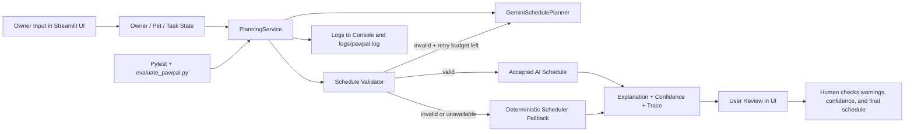

# PawPal+ AI Pet Care Planner

PawPal+ is an AI-assisted pet care planner that helps a busy owner turn a list of pet tasks into a realistic daily schedule. It matters because pet care is safety-sensitive: meals, medication, walks, and enrichment need to be prioritized correctly, and the system should stay useful even when the AI makes a bad plan or the API is unavailable.

This version of PawPal+ goes beyond a basic scheduler by integrating an **agentic workflow** and a **reliability/testing system** directly into the main application logic. The app can ask an AI planner for a schedule, validate that result against hard rules, retry with validator feedback, and safely fall back to a deterministic scheduler when needed.

## Original Project Summary

The original PawPal+ project from Module 2 was a rule-based Streamlit app for managing pets and pet care tasks. Its original goal was to let a user enter pets, create care tasks, and generate a daily plan using priorities, durations, preferred time windows, and fixed-time constraints.

## System Diagram



The main components are the Streamlit UI, the domain model (`Owner`, `Pet`, `Task`), the `PlanningService`, the Gemini planner, the validator, the fallback scheduler, and the testing/evaluation layer. Data flows from user input into the planning service, through AI generation and validation, and then back to the UI as a reviewed schedule with confidence, warnings, and trace information; automated tests and human review both help check result quality.

## Architecture Overview

The architecture is intentionally hybrid. The AI planner is good at generating natural scheduling decisions and readable explanations, but deterministic code is better at enforcing hard safety constraints like fixed medication times, task coverage, non-overlap, and time budgets. Because of that, PawPal+ treats the AI as a planning collaborator rather than a trusted oracle.

The `PlanningService` is the orchestration layer that makes the system feel agentic. It serializes the current owner state, requests an AI schedule proposal, validates it, retries with repair feedback when needed, records a workflow trace, and only then returns a final result. If the AI cannot be trusted, the service falls back to the existing rule-based scheduler so the application still works reproducibly.

## Key AI Features

### 1. Agentic Workflow

PawPal+ uses an observable multi-step workflow:

1. Serialize current owner, pets, preferences, and tasks.
2. Ask Gemini for a structured schedule proposal.
3. Validate the proposal against hard business rules.
4. Retry with validator error feedback if the proposal is invalid.
5. Accept the plan only if validation passes.
6. Otherwise use the deterministic scheduler fallback.
7. Show the final source, confidence score, warnings, and workflow trace in the UI.

### 2. Reliability / Testing System

Reliability is built into the main app and supporting tools:

- `schedule_validator.py` enforces hard constraints.
- `planning_service.py` logs each run, attempt, validation result, and fallback decision.
- `tests/` contains automated unit tests for domain logic, scheduling logic, validation, and planning orchestration.
- `evaluate_pawpal.py` runs predefined end-to-end scenarios and prints a pass/fail summary with confidence scores.

## Repository Structure

```text
app.py                    Streamlit UI
pawpal_system.py          Core domain classes and deterministic scheduler
planning_service.py       AI orchestration, retries, fallback, and trace metadata
gemini_planner.py         Gemini prompt/response wrapper
schedule_validator.py     Hard-rule validation and quality scoring
logging_config.py         Console + file logging
evaluate_pawpal.py        Evaluation harness for reliability summary
tests/                    Automated tests
uml_diagram.md            Architecture diagram source
```

## Setup Instructions

### 1. Create and activate a virtual environment

```bash
python3 -m venv .venv
source .venv/bin/activate
```

On Windows PowerShell:

```powershell
py -m venv .venv
.venv\Scripts\Activate.ps1
```

### 2. Install dependencies

```bash
pip install -r requirements.txt
```

### 3. Create your environment file

```bash
cp .env.example .env
```

Optional but recommended for AI planning:

```env
GEMINI_API_KEY=your_api_key_here
GEMINI_MODEL=gemini-2.5-flash
PAWPAL_MAX_RETRIES=1
PAWPAL_LOG_LEVEL=INFO
PAWPAL_LOG_FILE=logs/pawpal.log
```

If `GEMINI_API_KEY` is missing, the app still runs by using the deterministic scheduler fallback.

### 4. Run the app

```bash
streamlit run app.py
```

### 5. Run automated tests

```bash
pytest -q
```

### 6. Run the evaluation harness

```bash
python3 evaluate_pawpal.py
```

## Sample Interactions

These examples show the kinds of outputs the current system produces.

### Example 1: Valid AI plan accepted

Input:

- Owner available time: 60 minutes
- Pet: Buddy the dog
- Tasks:
  - `Walk`, 30 min, HIGH, fixed at `08:00`

Result:

- Plan source: `AI`
- Scheduled:
  - `08:00 - 08:30 Walk`
- Confidence: `1.00`
- Explanation: "Buddy's fixed walk was preserved first."

### Example 2: Invalid AI draft repaired on retry

Input:

- Owner preferred time window: `morning`
- Pet: Milo the cat
- Tasks:
  - `Medication`, 20 min, HIGH, fixed at `07:30`
  - `Brush`, 10 min, MEDIUM

Result:

- First AI attempt failed because it moved the fixed-time medication task.
- The validator returned error feedback.
- Second AI attempt passed validation.
- Final schedule:
  - `07:30 - 07:50 Medication`
  - `07:50 - 08:00 Brush`
- Attempts used: `2`

### Example 3: AI rejected and fallback scheduler used

Input:

- Owner available time: 30 minutes
- Pet: Nova the dog
- Tasks:
  - `Breakfast`, 10 min, HIGH, fixed at `08:00`
  - `Play`, 15 min, MEDIUM

Result:

- The AI kept producing an invalid schedule.
- PawPal+ rejected the proposal and used the deterministic scheduler.
- Plan source: `FALLBACK`
- Confidence from validation summary: `0.80`
- The UI still shows a usable schedule, validation details, and a workflow trace.

## Demonstrating What I Implemented

I strengthened the project to align more clearly with the rubric in several concrete ways:

- Added `.env.example` so setup is reproducible instead of implied.
- Added persistent file logging via `PAWPAL_LOG_FILE` in addition to console logging.
- Expanded `PlanningService` to return a workflow trace, confidence score, and clearer metadata about AI acceptance vs fallback.
- Updated the Streamlit UI to display plan source, attempts, confidence, validation state, errors, warnings, and a human review checkpoint.
- Added `evaluate_pawpal.py`, a reproducible evaluation harness that runs predefined scenarios and summarizes pass/fail behavior.
- Updated tests to assert the new orchestration metadata and trace behavior.

## Reliability And Evaluation Summary

Current measured results in this repo:

- `27/27` automated pytest tests passed locally.
- `3/3` evaluation harness scenarios passed locally.
- Evaluation harness average confidence score: `0.93`.
- The fallback scenario still produced a usable plan even after invalid AI output.

Short summary:

> 27 out of 27 unit/integration-style tests passed. 3 out of 3 evaluation scenarios passed. Confidence scores ranged from 0.80 to 1.00, and the system remained usable because validator-driven fallback prevented bad AI schedules from becoming final outputs.

## Design Decisions And Trade-Offs

- I kept the original deterministic scheduler instead of replacing it because pet care contains hard constraints that should not depend entirely on model behavior.
- I used validation plus retry instead of blind trust because AI-generated schedules can look plausible while still breaking fixed-time rules.
- I used a hybrid confidence approach based on validation quality score rather than raw model self-reporting because rule-based verification is more actionable here.
- I did not add a full RAG pipeline because the strongest fit for the current project was agentic planning with reliability guardrails, not external knowledge retrieval.

The trade-off is that the system is more complex than a single-prompt chatbot, but it is meaningfully safer and easier to evaluate.

## Testing Summary

What worked:

- Fixed-time tasks were consistently protected by validation.
- Retry logic successfully repaired an invalid AI first draft in the evaluation harness.
- Fallback scheduling preserved usability when AI output was invalid or unavailable.
- Logging and trace metadata made the system’s decisions much easier to inspect.

What did not work perfectly:

- Confidence is still a proxy based on validation quality, not a true measure of real-world correctness.
- The evaluation harness uses controlled scenarios rather than broad randomized testing.
- AI explanations can still vary in wording even when the schedule itself is valid.

What I learned:

- Reliability features matter most when the AI is partially correct, not only when it completely fails.
- Validation rules turn vague “trust the model” behavior into something inspectable and testable.

## Reflection And Ethics

### Limitations and Biases

The system reflects the constraints and assumptions encoded by its rules and prompts. It assumes task durations are known, priorities are entered correctly, and a day can be planned as clean time blocks; that may not match every household or pet care routine.

### Possible Misuse and Prevention

A user could over-trust the AI for safety-critical care, especially medication scheduling. To reduce that risk, the app exposes validation details, marks fallback behavior clearly, logs decisions, and encourages human review before acting on the plan.

### Reliability Surprise

What surprised me most was how helpful validator feedback was for recovery. A single invalid AI response did not have to mean failure; treating the validator as a correction mechanism made the workflow much more robust.

### Collaboration With AI During Development

AI was helpful when shaping the project into a stronger systems design instead of a single-script demo. One helpful suggestion was to expose the planning trace and confidence information in the UI, because that made the agentic workflow visible and easier to explain in the README.

One flawed AI suggestion was to assume that setup instructions using `python` were sufficient everywhere. In this environment, `python3` was the correct executable, so I corrected the documentation and demonstration commands to match what actually worked locally.

## Reflection

This project taught me that building with AI is less about prompting once and more about designing reliable systems around model behavior. The most valuable problem-solving pattern here was combining strengths: using AI for flexible planning and explanation, while using deterministic code for validation, recovery, observability, and reproducibility.

## Additional Artifacts

- Architecture source: [uml_diagram.md](uml_diagram.md)
- Planning roadmap: [IMPLEMENTATION_PLAN.md](IMPLEMENTATION_PLAN.md)
- Reflection notes: [reflection.md](reflection.md)
