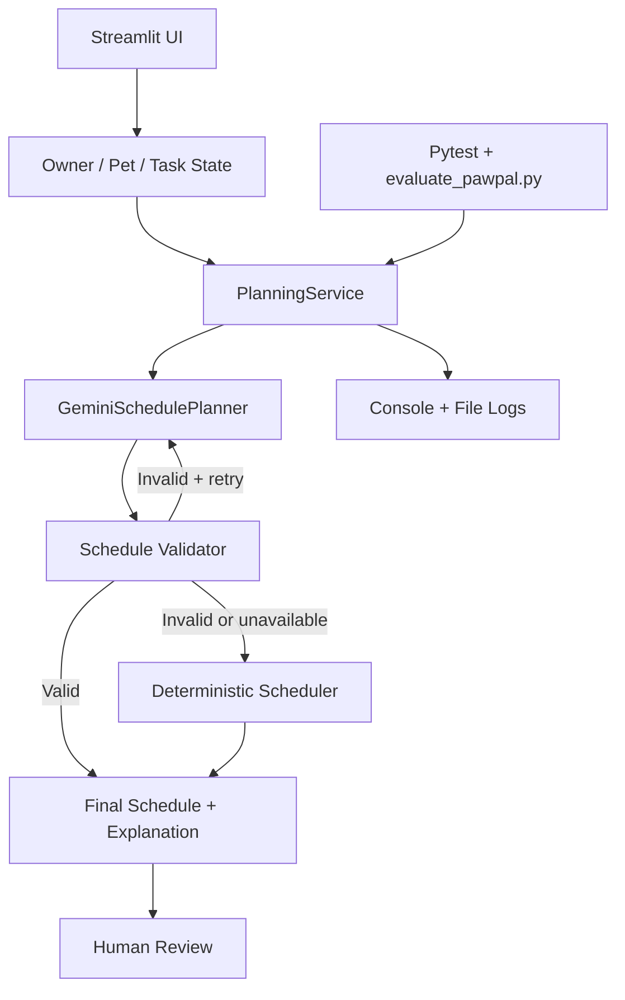

Short explanation:

- The user enters pets, tasks, time budget, and preferences in the Streamlit UI.
- `PlanningService` coordinates AI planning, validation, retry, fallback, and explanation generation.
- The validator acts as a guardrail before any AI proposal becomes the final schedule.
- Humans remain in the loop by reviewing the source, confidence, warnings, and final schedule in the UI.
